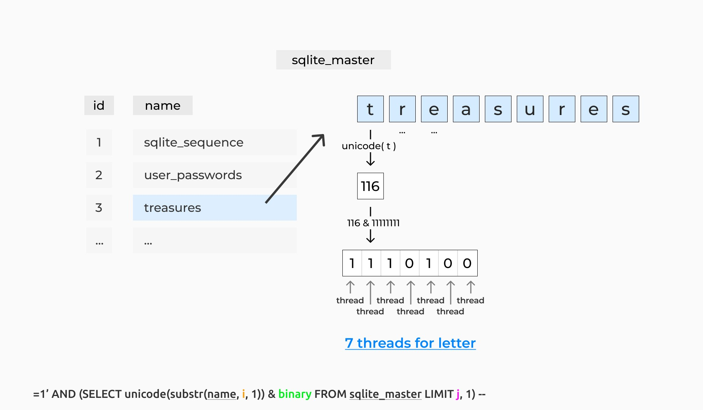
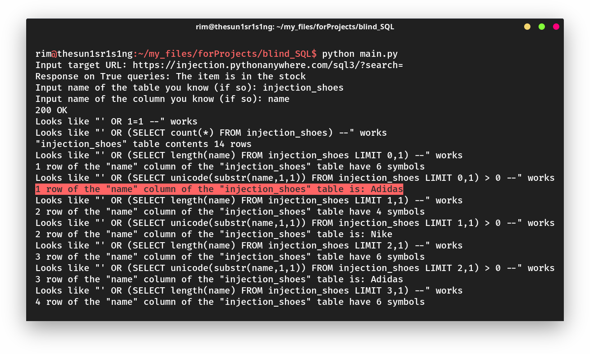

# SQL Blind Injection Tool
A tool for blind SQL injections that uses multithreaded bitwise comparisons to find values of cells in SQL-tables.

Works with SQLite at least and supports cookies.

It's able to:
* Search cell values by columns in a table
* Search characters count in a cells by columns in a table
* Search rows count in a table

The search algorithm is shown below. \
Knowing the name of its column ('sqlite_master' by default in sqlite, for example) and the column name of it ('name' in sqlite) you can find values ​​of every cell in every row. And the fastest algorithm for this is checking the binary values of every character in every cell, which can be perform using multiple threads. Considering this, we can send only 7 requests to get the standard 7-bit letter, and using 1000 threads, we get ~142 letters per moment (it's also worth keeping in mind requests to get the length of a cell value).



The number of bits need to compare (7 by default for ASCII) and the number of threads can be specified as input data.

## Installing
```
git clone https://github.com/Sunlight-Rim/sqlbit.git
pip3 install -r requirements.txt
```
## Usage
It does not accept command line arguments, so you can specify data in the config file or at runtime program.
```
python sqlbit.py
```



---
**Note:** please, use it only for your own servers or for the servers of those owners with whom you have agreed in advance.
